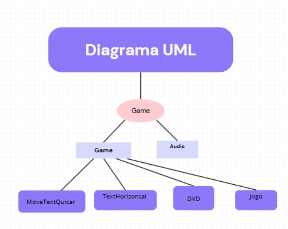

#  Refatoração, UML, Herança e Recursos de Áudio

## Descrição Geral
O projeto exibe um texto se movimentando pela tela no estilo “DVD” (batendo nas bordas), o código foi projetado para torná-lo mais organizado, adicionar novos comportamentos de movimento por meio de herança e subclasses, e incorporar recursos de áudio. Neste momento a função para movimentação do texto está na forma horizontal, e o texto está "quicando" para tórna-lo mais divertido. Também foi criado diagramas UML que representem o projeto com a versão final.

## Diagramas UML projeto final

